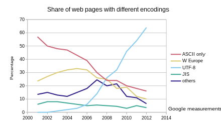
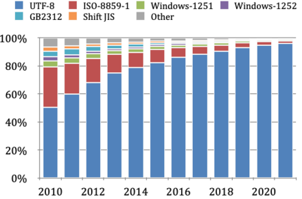

## What is Unicode?

Unicode is a comprehensive encoding standard designed to represent characters and symbols from all global languages and scripts uniformly. Every character is assigned a unique numerical identifier, known as a code point. These code points are then encoded into binary data using formats such as UTF-8, enabling efficient storage and transmission.

## History Context

### Before Unicode

> Characters before Unicode
>
> Fundamentally, computers just deal with numbers.  They store letters and other characters by assigning a number for each one.  Before the Unicode standard was developed, there were many different systems, called character encodings, for assigning these numbers.  These earlier character encodings were limited and did not cover characters for all the world's languages. Even for a single language like English, no single encoding covered all the letters, punctuation, and technical symbols in common use.  Pictographic languages, such as Japanese, were a challenge to support with these earlier encoding standards.
>
> Early character encodings also conflicted with one another.  That is, two encodings could use the same number for two different characters, or use different numbers for the same character.  Any given computer might have to support many different encodings. However, when data is passed between computers and different encodings it increased the risk of data corruption or errors.
>
> Character encodings existed for a handful of "large" languages. But many languages lacked character support altogether.
>
> \-- [Unicode official site](https://home.unicode.org/about-unicode/)

Computers operated solely with numbers, assigning numeric values to letters and other characters. Historically, various character encoding systems existed, each with limitations in language and symbol coverage, particularly for non-Latin scripts like Japanese. These early systems often conflicted, where identical numbers could represent different characters, leading to data corruption and compatibility issues.

### Evolution of Encoding standards

Despite various text encoding standards developed, there are roughly 3 main stages:

- [ASCII](https://en.wikipedia.org/wiki/ASCII): The American Standard Code for Information Interchange, developed in the 1960s, utilized 7 bits per character, limiting it to 128 distinct symbols. This sufficed for basic English text but was inadequate for other languages using the Latin script.
- [ISO/IEC-8859](https://en.wikipedia.org/wiki/ISO/IEC_8859): An extension of ASCII, this encoding used 8 bits per character, thus supporting 256 possible symbols, which allowed for the inclusion of additional characters used in Western European languages.
- [Unicode](https://home.unicode.org/): Established by the Unicode Consortium, Unicode supports a vast array of characters and scripts, facilitating global communication. As of its latest version, Unicode defines over 149,813 characters across 161 scripts. UTF-8 is the most common encoding format for Unicode.

Over the years, UTF-8 has been taking over the encoding standard globally.

[Popularity of text encodings](https://en.wikipedia.org/wiki/Popularity_of_text_encodings)




## Unicode's Core Principles

The name "Unicode" itself represents its foundational goals:

- **Universal**: Support for all world languages.
- **Uniform**: Consistent fixed-width codes for efficient processing.
- **Unique**: Each bit sequence corresponds to one specific character.

## Unicode on Web Pages

### UTF-8 and UTF-16 Encoding

- [UTF-8](https://en.wikipedia.org/wiki/UTF-8): This variable-length encoding system can represent characters in one to four bytes (8 bits per unit), making it compatible with ASCII and the most prevalent encoding for web and email.
- [UTF-16](https://en.wikipedia.org/wiki/UTF-16): Utilized primarily by major operating systems, UTF-16 encodes characters in one or two 16-bit units. It is particularly efficient for scripts where most characters fit within a single unit (i.e. non-Latin languages).

### Implementation in Web Technologies

Web browsers and text editors predominantly use UTF-8 by default. Web content such HTML, CSS, and JavaScript files are encoded in UTF-8, with character sets specified in HTTP headers (along with MIME type in the header [`Content-Type`](https://developer.mozilla.org/en-US/docs/Web/HTTP/Headers/Content-Type)) or HTML meta tags ([`<meta charset="utf-8"></meta>`](https://developer.mozilla.org/en-US/docs/Web/HTML/Element/meta#charset)) to ensure correct interpretation by browsers.

## Handling Unicode in JavaScript

Despite the widespread use of UTF-8 for file encoding, JavaScript internally operates with UTF-16 due to historical reasons. This affects how JavaScript handles strings, particularly for characters represented by two UTF-16 units, like many emojis.

> In JavaScript, characters can be represented as escapes in two ways `\uHHHH` and `\u{H...H}`, where HHHH in `\uHHHH` is a 4 digits long UTF-16 code, and H...H in `\u{H...H}` is a 1 to 6 digits long Unicode code point. Character escape representation `\u{H...H}` was [introduced in ECMAScript 6](https://262.ecma-international.org/6.0/#sec-literals-string-literals).
>
> For example, for emoji 🤗, the character escapes can be `\ud83e\udd17` or `\u{1f917}`.

### JavaScript String Operations and Unicode

- Character Access: JavaScript's string indexing (`string[index]`) and [`.charAt()`](https://developer.mozilla.org/en-US/docs/Web/JavaScript/Reference/Global_Objects/String/charAt) methods return a character at the index based on UTF-16 code units. For characters represented by two code units (surrogate pairs), these methods will return an incomplete character.

```js
const string = 'Hi👍' // Character escapes: '\u0048\u0069\ud83d\udc4d'

const h = string[0] // Retrieve the character 'H' (the first unit '\u0048'), because 'H' is encoded to one single unit of UTF-16
const i = string[1] // Similarly, retrieve the character 'i' (the second unit '\u0069')
const e = string[2] // The result is not we expected character 👍. Instead, the third unit escape '\ud83d' is retrieved, which is the first half of a pair of escapes of 👍.
const emoji = string[2] + string[3] // Concatenating the two units in sequence, the complete emoji 👍 ('\ud83d\udc4d') is retrieved.

// `.charAt()` behaves the same as direct indexing, it may not return the correct character, however, the unit of the indexed position:
const e1 = string.charAt(3) // '\udc4d'
```

[`.charCodeAt()`](https://developer.mozilla.org/en-US/docs/Web/JavaScript/Reference/Global_Objects/String/charCodeAt) behaves similarly to indexing and `.charAt()`, however, it returns an integer between 0 and 65535 representing the UTF-16 code unit at the specified index:

```js
const string = 'Hi👍' // Character escapes: '\u0048\u0069\ud83d\udc4d'
const e1 = string.charCodeAt(3) // Got an integer 56397
const e2 = e1.toString(16) // Converted to hexadecimal 'dc4d'
```

- Unicode Methods: Methods like [`.codePointAt()`](https://developer.mozilla.org/en-US/docs/Web/JavaScript/Reference/Global_Objects/String/codePointAt) are used to returns the **complete Unicode code points** for a character that starts at the specified index, properly handling characters that are represented by surrogate pairs.

> Note that the index is still based on UTF-16 code units, not Unicode code points.

```js
const string = 'Hi👍' // Character escapes: '\u0048\u0069\ud83d\udc4d'

const e1 = string.codePointAt(2) // Got an integer 128077, which is the Unicode code point of 👍, decoded from 0xd83ddc4d

// Below we got an integer 56397 (hexadecimal is 0xdc4d). That doesn't get the correct Unicode code point,
// due to being indexed at the second unit of 👍 ('\ud83d\udc4d')
const e5 = string.codePointAt(3)
```

- String length: The [`.length`](https://developer.mozilla.org/en-US/docs/Web/JavaScript/Reference/Global_Objects/String/length) property of a string object counts UTF-16 units, which may not correspond to the actual number of characters, especially when the string contains two-unit characters (surrogate pairs).

```js
const string = 'Hi👍' // Character escapes: '\u0048\u0069\ud83d\udc4d'
const len = string.length // Got 4, because '\u0048\u0069\ud83d\udc4d' has 4 units
```

To accurately count characters, especially when including emojis or other complex characters, you can use `[...string].length` or `for...of` loop, both of which [iterate a string by Unicode code points](https://developer.mozilla.org/en-US/docs/Web/JavaScript/Reference/Global_Objects/String/@@iterator), regardless of whether they're represented by one or two UTF-16 code units.

```js
const string = 'Hi👍' // Character escapes: '\u0048\u0069\ud83d\udc4d'

// Fundamentally, `[...string]` split the string to an array with its iterator which iterates based on Unicode code points
const len1 = [...string].length // Got 3

// Below loop prints the 3 single characters: 'H', 'i', and '👍'
for (const str of string) {
  console.log(str)
}
```

Additionally, there're two static methods [`String.fromCharCode()`](https://developer.mozilla.org/en-US/docs/Web/JavaScript/Reference/Global_Objects/String/fromCharCode) and [`String.fromCodePoint()`](https://developer.mozilla.org/en-US/docs/Web/JavaScript/Reference/Global_Objects/String/fromCodePoint) introduced in ECMAScript 6, used to convert specified sequences of UTF-16 codes and Unicode code points to strings.

## Conclusion

The development and widespread implementation of Unicode have been critical in supporting the diverse range of languages and symbols used around the world, thereby enabling truly global communication. As technology continues to evolve, particularly in web technology, the role of Unicode remains central in the ongoing efforts towards enhancing internationalization and localization in digital environments. This foundational standard not only facilitates compatibility across different systems and platforms but also ensures that digital communications, especially on the web, remain inclusive and accessible to all users, regardless of language. By standardizing character representation across the internet and software applications, Unicode plays a pivotal role in the seamless global exchange of information.
